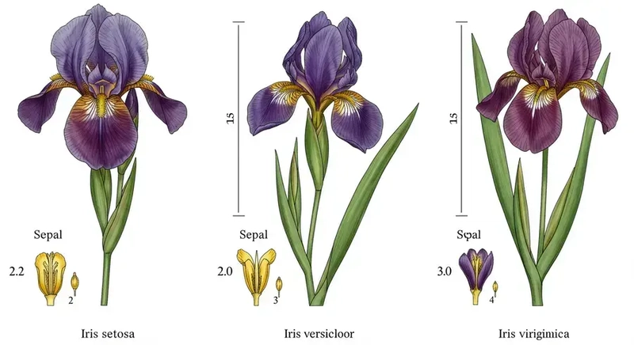

# Documentação do Dataset Iris 🌸

## 1. Visão Geral

O **Iris Dataset** é o conjunto de dados utilizado para validar a inferência real na NPU. Ele consiste na classificação de flores em 3 espécies baseando-se em 4 medidas físicas.

!!! info "Iris Dataset"
    O **Iris Dataset** é um clássico para treinamento de classificações via aprendizado de máquina. Foi inicialmente proposto por Ronald Fisher em 1936. Contém 50 amostras para cada uma das três espécies: *Iris Setosa*, *Iris Virginica*, *Iris Versicolor* - utilizando-se quatro características numéricas: **comprimento da sépala**; **largura da sépala**; **comprimento da pétala**; e **largura da pétala**. 

{ .hero-img }


Este dataset foi escolhido porque suas dimensões (4 entradas) casam perfeitamente com a arquitetura física da NPU (Matriz Sistólica 4x4), permitindo validação sem necessidade de *tiling*. No entanto, por serem três categorias será utilizada a técnica de *padding*. 

!!! note "Técnica de *Tiling*"
    A técnica de ***Tiling*** é utilizada quando as dimensões do problema (por exemplo, número de entradas, neurônios ou tamanho de matrizes) excedem os recursos físicos disponíveis na arquitetura. Nesse caso, os dados são particionados em blocos menores (tiles) compatíveis com a capacidade da unidade de processamento e processados sequencialmente ou em múltiplos ciclos, com posterior composição dos resultados parciais.

!!! note "Técnica de *Padding*"
    A técnica de ***Padding***, por sua vez, consiste em expandir artificialmente as dimensões dos dados para que se ajustem à granularidade fixa do hardware. Isso é feito adicionando valores neutros (tipicamente zeros) às entradas, pesos ou saídas, garantindo alinhamento estrutural com a arquitetura física. No caso, como há três categorias e a matriz sistólica opera naturalmente em múltiplos de quatro, adiciona-se uma quarta classe fictícia com valores nulos apenas para compatibilização dimensional, sem impacto semântico no resultado final.

## 2. Estrutura dos Dados

### 2.1. Entradas (Features)
Cada amostra enviada para a NPU (`valid_in`) é um vetor de 4 bytes (`INT8`), representando:

| Índice | Característica | Unidade | Representação NPU |
| :--- | :--- | :--- | :--- |
| **0** | Comprimento da Sépala | `[cm]` | `INT8` (Quantizado) |
| **1** | Largura da Sépala | `[cm]` | `INT8` (Quantizado) |
| **2** | Comprimento da Pétala | `[cm]` | `INT8` (Quantizado) |
| **3** | Largura da Pétala | `[cm]` | `INT8` (Quantizado) |

### 2.2. Saídas (Classes)
A NPU retorna um vetor de 4 bytes. Os 3 primeiros correspondem aos *scores* (***logits***) de cada classe:

| Índice (Coluna) | Espécie (Classe) | Característica Principal |
| :--- | :--- | :--- |
| **0** | **Iris Setosa** | Pétalas pequenas e largas. Fácil de separar. |
| **1** | **Iris Versicolor** | Tamanho médio. Confunde-se com a Virginica. |
| **2** | **Iris Virginica** | Pétalas grandes e longas. |
| **3** | *(Padding)* | Não utilizado (valor ignorado). |

## 3. Mapeamento no Hardware

A NPU adota uma arquitetura de **matriz sistólica** com dataflow do tipo ***Output-Stationary (OS)***. Essa escolha impacta diretamente o mapeamento de operações de multiplicação-acumulação (MAC) e o padrão de comunicação entre os elementos de processamento (PEs).

!!! note "Output-Stationary Dataflow"
    No modelo **Output-Stationary**, cada elemento de processamento (PE) é responsável por acumular e manter localmente o valor parcial de um elemento da matriz de saída.

    Durante a computação de uma multiplicação de matrizes (GEMM), os operandos de entrada (ativação e pesos) fluem através da matriz sistólica, enquanto as **somas parciais permanecem estacionárias dentro do PE** até que o resultado final esteja completamente acumulado.

    Formalmente, considerando:
    
    $$
    C[i,j] = Σ_k A[i,k] · B[k,j]
    $$

    cada PE(i,j) mantém o acumulador associado a C[i,j], recebendo sequencialmente os produtos A[i,k]·B[k,j].

### 3.1. Matriz de Pesos (Weights)

O modelo treinado gera uma matriz de pesos de dimensão [4 entradas x 3 saídas].
Na NPU 4x4, adicionamos uma coluna de zeros (padding) para completar a matriz 4x4.

- **Load Order**: Os pesos são carregados via `ADDR_FIFO_W` (`0x10`) e fluem pela matriz sistólica conforme a ordem do fluxo Output-Stationary.
- **Layout Lógico**:
    ```text
    W[0,0] W[0,1] W[0,2] 0
    W[1,0] W[1,1] W[1,2] 0
    W[2,0] W[2,1] W[2,2] 0
    W[3,0] W[3,1] W[3,2] 0
    ```

### 3.2. Quantização (`INT8`)

Como a NPU opera com inteiros de 8 bits, os valores reais (ex: 5.1 cm) são convertidos:

1.  **Escala:** Encontramos o valor máximo absoluto no dataset de treino (ex: 7.9 cm).
2.  **Fator:** `Scale = 7.9 / 127`.
3.  **Conversão:** `Valor_Int8 = Valor_Float / Scale`.

Isso garante que usamos toda a faixa dinâmica de `-128` a `+127`.

### 3.3. Calibração da PPU (O Segredo da Acurácia)

A NPU opera internamente com acumuladores de 32 bits, mas a saída é limitada a 8 bits (`INT8`). Sem calibração, ocorre o fenômeno de **saturação** (*quantization saturation*), prejudicando a acurácia do modelo.

#### 3.3.1. Problema: Saturação
Durante a inferência, a soma dos produtos (Pesos x Entradas) pode gerar valores muito altos, por exemplo `50.000`.

Ao converter diretamente esse valor para `INT8` (intervalo [-128, 127]), ocorre saturação:

- `50.000` -> vira `127` (**clamp**)

- `48.000` -> vira `127` (**clamp**)

!!! warning "***Clamping***"
    ***Clamping*** é a operação de saturação que restringe um valor numérico a um intervalo fechado pré-definido.

    Formalmente, dado um intervalo [`min`, `max`], o valor clamped é definido como:

    $$
    y = min(max(x, min), max)
    $$

    Essa operação é também chamada de **saturação**, pois valores que ultrapassam os limites são "forçados" para a extremidade mais próxima do intervalo permitido.

!!! example "Aluno Nota Dez"
    Imagine uma prova cuja nota máxima é 10.

    - Se um aluno obtém 12 pontos brutos, a nota registrada será 10.
    - Não porque ele "só consegue tirar 10", mas porque **o sistema de avaliação impõe 10 como limite superior**.

    O clamping funciona exatamente assim: o valor real pode ser maior,
    mas o formato de representação define o teto permitido.

Apesar de `50.000` ser maior que `48.000`, ambos passam a ter **exatamente a mesma representação**.

Com isso, o hardware **perde a capacidade de diferenciar qual valor era realmente maior**.  
Na prática, o modelo entra em um regime de **empate artificial**, e a decisão final se assemelha a um chute aleatório — semelhante a uma questão de múltipla escolha em que duas alternativas parecem igualmente corretas.

#### 3.3.2. Solução: Re-escalonamento (***Rescaling***)
Configuramos a PPU para multiplicar e dividir o resultado acumulado *antes* de cortar para 8 bits, trazendo os valores para a faixa dinâmica correta (`-128` a `+127`).

**Configuração Utilizada no Teste:**

- **Mult (0x08):** `100` (Aumenta precisão antes da divisão)
- **Shift (0x04):** `16` (Divide por $2^{16} = 65536$)

**Matemática Real:**
$$
Saída = \frac{Acumulador \times 100}{65536}
$$

**Exemplo Prático:**
Tomando o mesmo valor de `50.000` que antes saturava:
$$
\frac{50.000 \times 100}{65536} \approx \frac{5.000.000}{65536} \approx 76
$$

* O valor `76` cabe perfeitamente em 8 bits.
* O valor `48.000` viraria `73`.
* A NPU agora consegue distinguir que **`76` > `73`**, restaurando a acurácia.

## 4. Exemplo de Inferência

**Entrada (Amostra Real de uma Versicolor):**

- Sépala: `6.0 cm`, `2.2 cm`
- Pétala: `4.0 cm`, `1.0 cm`

**Processamento:**

1.  O vetor quantizado entra na NPU.
2.  A matriz sistólica multiplica pelas colunas de pesos das 3 flores.
3.  A PPU aplica o Bias e faz o Rescaling.

**Saída Esperada (Scores):**

- **Col 0 (Setosa)**: -45 (Baixa probabilidade)
- **Col 1 (Versicolor)**: **82** (Alta probabilidade) 🏆
- **Col 2 (Virginica)**: 30 (Média probabilidade)

O testbench (driver) lê esses valores, aplica `argmax([ -45, 82, 30 ])` e retorna **Classe 1 (Versicolor)** definindo a categoria da flor de íris.

## Referências

- FISHER, Ronald A. The use of multiple measurements in taxonomic problems. **Annals of eugenics**, v. 7, n. 2, p. 179-188, 1936.