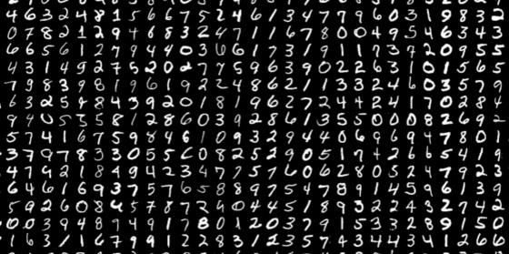

# Documentação do Dataset MNIST 🔢 

## 1. Visão Geral

O **MNIST Dataset** foi o conjunto de dados utilizado para validar a capacidade de **Tiling (Ladrilhamento)** e o processamento de grandes volumes de dados na NPU. 

!!! info "MNIST Dataset"
    O banco de dados **MNIST** (*Modified National Institute of Standards and Technology*) é um grande banco de dígitos manuscrítos comumente utilizado para o treinamento de diversos sistemas de processamento de imagens. Conta com 60.000 imagens de treinamento e 10.000 imagens de teste.

{ .hero-img }
    
Utilizaremos para o treinamento de redes neurais para o reconhecimento de dígitos manuscritos (0 a 9) a partir de imagens em escala de cinza de **28x28 pixels**.

Diferente do Iris, este dataset excede as dimensões físicas da NPU (784 entradas vs 4 linhas físicas), exigindo que o driver de software fracione o problema em blocos menores que são acumulados temporalmente pelo hardware - por isso, serve como teste para a técnica de ***tiling***. 

## 2. Estrutura dos Dados

### 2.1. Entradas (Features)
Cada amostra é uma imagem de $28 \times 28$ pixels, que é "achatada" (*flattened*) em um vetor linear de 784 bytes (`INT8`).

| Índice | Feature (Pixel) | Representação Original | Representação NPU |
| :--- | :--- | :--- | :--- |
| **0** | Pixel (0,0) - Canto Sup. Esq. | `0` (**Preto**) a `255` (**Branco**) | `INT8` |
| **1..782** | Pixels intermediários | `0` a `255` | `INT8` |
| **783** | Pixel (27,27) - Canto Inf. Dir. | `0` a `255` | `INT8` |

### 2.2. Saídas (Classes)
A NPU deve calcular scores para **10 classes**. Como o array tem largura 4, o processamento é feito em 3 passadas de colunas:

| Índice | Dígito (Classe) | Passada do Tiling |
| :--- | :--- | :--- |
| **0, 1, 2, 3** | Dígitos **0, 1, 2, 3** | 1ª Passada |
| **4, 5, 6, 7** | Dígitos **4, 5, 6, 7** | 2ª Passada |
| **8, 9** | Dígitos **8, 9** | 3ª Passada (+ **Padding**) |

## 3. Mapeamento no Hardware (Tiling)

O desafio do MNIST é mapear uma matriz de pesos virtual de `[784 entradas x 10 saídas]` em um hardware físico de `[4x4]`. Utilizamos a estratégia de **Double Tiling**. Em outras palavras, é feito o *tiling* tanto para matriz de pesos (*weights*) quanto de entradas (*inputs*).

### 3.1. Tiling Vertical (Accumulation)
Como temos 784 entradas e apenas 4 linhas:

- O driver divide as 784 entradas em **196 blocos** de 4 valores.
- **Controle:**
    - No 1º bloco: O driver envia flag `ACC_CLEAR` (zera acumuladores).
    - Nos blocos centrais: A NPU soma os resultados parciais internamente.
    - No 196º bloco: O driver envia flag `ACC_DUMP` (libera o resultado).

### 3.2. Tiling Horizontal (Passadas)
Como temos 10 classes e apenas 4 colunas:

- O processo acima é repetido 3 vezes para cobrir todas as colunas da matriz de pesos.
- Como são 10 classes, a última passada é realizada utilizando a técnica de *padding*. 

## 4. Calibração da PPU

No MNIST, a dispersão dos dados é diferente do Iris (muitos zeros devido ao fundo preto das imagens). Uma calibração teórica baseada no pior caso leva à perda total de sinal.

### 4.1. Problema: Over-Shifting

O pior caso teórico (todos pixels brancos × todos pesos máximos) geraria um acumulador de ~12.000.000.

- Para acomodar isso em 8 bits, precisaríamos de um **Shift = 17** (dividir por 131.072).
- Porém, a soma real observada nas inferências raramente passa de **32.000**.
- **Resultado:** $32.000 \div 131.072 = 0$. A saída da NPU seria sempre zero.

### 4.2. Solução: Calibração por Observação
Ajustamos o shift baseando-nos nos valores máximos reais observados durante a execução do conjunto de validação.

**Configuração Otimizada (Smart Calibration):**

- **Mult (0x08):** `1` (Pass-through)
- **Shift (0x04):** `9` (Divide por $2^9 = 512$)

**Matemática Real:**
$$
Saída = \frac{Acumulador \times 1}{512}
$$

**Exemplo Prático:**
Se o acumulador final para o dígito `7` for `32.700`:
$$
\frac{32.700}{512} \approx 63
$$

- O valor **63** é um score alto e válido em `INT8`.
- Isso permitiu atingir acurácia **bit-exact** em relação ao modelo de software.

## 4. Exemplo de Inferência

**Entrada (Imagem de um "7"):**
- Vetor de 784 bytes, onde a maioria é `0` (fundo), mas os pixels centrais formam o desenho.

!!! note "Matrizes Esparsa"
    **Matrizes esparsas são aquelas em que a maioria dos elementos é nula**. EEm arquiteturas de aceleradores (NPUs) projetadas com fluxos de dados fixos (como arrays sistólicos padrão), todas as multiplicações são executadas independentemente do valor dos operandos. O processamento de operações $0 \times x$ consome os mesmos ciclos de clock e energia que operações com valores não nulos.
    
    Em contraste, processadores de propósito geral (CPUs) podem explorar a esparsidade via software, utilizando estruturas de dados dinâmicas ou desvios condicionais para evitar a execução de instruções inúteis. Assim, se a NPU não implementar técnicas de compressão nativa ou *zero-skipping* em hardware, a sua eficiência computacional despenca à medida que a esparsidade da matriz aumenta, reduzindo a vantagem relativa sobre a CPU.
    
    Assim, **o ganho relativo de aceleração da NPU em relação à CPU diminui à medida que a matriz se torna mais esparsa**, a menos que a arquitetura implemente técnicas de compressão ou *zero-skipping*.

!!! example "Big-O Notation"
    Considere uma multiplicação matriz-vetor típica de **MLP**s (*Multilayer Perceptrons*):

    $$
    y_i = \sum _{j=1} ^n w_{ij} x_j
    $$

    Se a matriz é $n \times m$:

    - No caso **denso** o número de multiplicações necessárias tem ordem de complexidade: $ O(n^2) $. 
    
    - No caso **esparso**, se definirmos $k$ como o número de elementos não nulos, a utilização de representações comprimidas em hardware deedicado reduz a complexidade temporal efetiva para $ O(k) $. O custo deixa de ser quadrático e passa a escalar linearmente apeenas com os dados úteis.  

!!! note "Zero-Skipping"
    *Zero-skipping* é uma técnica de microarquitetura na qual operandos com valor zero são detectados antes de entrarem no *pipeline* de execução. As operações correspondentes não são emitidas para a unidade de multiplicação, economizando energia (via *clock gating*) ou liberando o recurso de hardware para processar os próximos valores úteis da fila, aumentando o *throughput* real do sistema.

**Processamento (Resumo):**

1.  **Passada 1 (Dígitos 0-3):** Acumuladores terminam baixos (ex: -10, -5, 2, -20).
2.  **Passada 2 (Dígitos 4-7):**
    - O acumulador da coluna 3 (Dígito 7) soma muita correlação positiva.
    - Valor bruto atinge `32.000`.
    - PPU aplica Shift 9 -> Saída **62**.
3.  **Passada 3 (Dígitos 8-9):** Acumuladores baixos.

**Saída Final (Scores):**
```text
[ -10, -5, 2, -20,  15, -8, -2,  62,  5,  -12 ]
                                 ^
                                 Dígito 7
```

## Referências

- KHODABAKHSH, H. MNIST Dataset. Disponível em: <https://www.kaggle.com/datasets/hojjatk/mnist-dataset>.
- LECUN, Yann. The MNIST database of handwritten digits. Disponível em: <http://yann.lecun.com/exdb/mnist/>. 1998.
‌